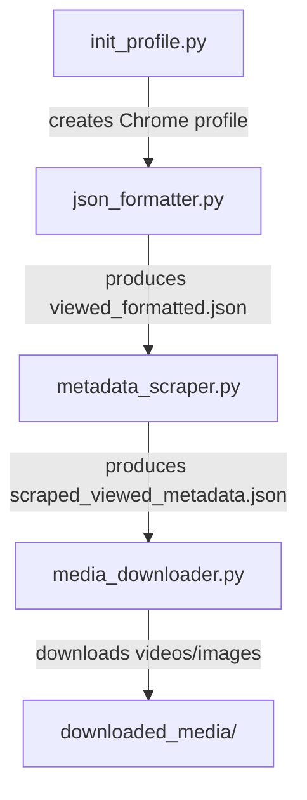

# Facebook Metadata Scraper

A lightweight set of Python scripts that automate the extraction of Facebook post metadata and media using Selenium and BeautifulSoup.

## Overview
These four scripts work together to:
1. **Create a persistent Chrome user‑profile** that stores your Facebook login cookies.
2. **Convert the raw `recently_viewed.json`** (downloaded from Facebook) into a tidy list of URLs.
3. **Visit each URL**, scrape useful metadata (post ID, timestamps, like counts, comment counts, captions, etc.) and store the results in `scraped_viewed_metadata.json`.
4. **Download any media** (videos, thumbnails, profile pictures) referenced in the scraped metadata.

---
### Python Packages
```powershell
pip install selenium beautifulsoup4 requests
```
>Install the Python dependencies as shown above.
---

## Project Structure

| File | Purpose |
|------|---------|
| `init_profile.py`| Launches an automated Chrome instance, prompts you to log in to Facebook, and saves the profile including the cookies in `ChromeScraperProfile/`. |
| `json_formatter.py`| Reads `recently_viewed.json` (or your own input json file) and writes a clean `viewed_formatted.json` (or your own output formatted json file name) containing a flat list of URLs and associated metadata. |
| `metadata_scraper.py` | Iterates over the formatted URLs, scrapes post metadata using Selenium + BeautifulSoup4, and saves the result to `scraped_viewed_metadata.json` (or your own output metadata json file name). |
| `media_downloader.py` | Consumes the JSON produced by the scraper and downloads all media files into a structured `downloaded_media/` directory (or your own directory name). |

---

## Workflow Overview



---

## Usage Guide

> **All commands are meant to be run from the project root (`d:\Downloads\internship`).**

### 1️⃣ Initialise Chrome Profile (`init_profile.py`)
```powershell
python init_profile.py
```
- A Chrome window will open and navigate to `https://www.facebook.com`.
- **Log in** with your credentials and optionally tick “Remember me”.
- You have **100 seconds** to complete the login before the browser closes automatically.
- The profile (including cookies) is stored in `ChromeScraperProfile/`, which will be reused by the later scripts.

### 2️⃣ Format the raw JSON (`fb_json_formatter.py`)
```powershell
python fb_json_formatter.py -i recently_viewed.json -o viewed_formatted.json
```
- The script extracts the `uri` (URL) for each entry and de‑duplicates them and also skips the invalid ones.
- Result: `viewed_formatted.json` – a tidy JSON with a top‑level `views` array and a `meta` block.

### 3️⃣ Scrape Metadata (`metadata_scraper.py`)
```powershell
python metadata_scraper.py -i viewed_formatted.json -o scraped_viewed_metadata.json -l 50 # optional: stop after 50 URLs
```
- Reads the formatted URLs, opens each page in a **headless** Chrome instance that re‑uses the profile cookies from step 1.
- Extracts:
  - Post ID, timestamps (Unix + ISO)
  - Caption, description, relevant comments (top 6)
  - Like and comment counts (robust parsing of various UI patterns)
  - Media URLs (video, thumbnail, profile picture)
  - Additional context (location, side‑car count, pinned flag, etc.)
- Progress and a run‑summary are printed to the console and saved alongside the scraped results.

### 4️⃣ Download Media (`media_downloader.py`)
```powershell
python media_downloader.py -i scraped_viewed_metadata.json -dir downloaded_media
```
- Traverses the `results` array and fetches each media URL using `requests` (streamed download).
- Files are stored in `downloaded_media/<MEDIA_ID>/`:
  - `video.mp4` (if present)
  - `thumbnail.jpg` (if present)
  - `profile_pic.jpg` (if present)
- Logs give you a quick overview of successes and skipped items.

---

## JSON Formats Explained

### `recently_viewed.json`
The raw export from Facebook. It contains nested categories → children → `entries` objects. Each entry holds a `data` dict with fields such as `uri`, `name`, `value`, and `timestamp`.
```json
"recently_viewed": [
    {
      "name": "Videos and shows",
      "description": "Videos and shows you've recently viewed, and the time you've spent watching",
      "children": [
        {
          "name": "Time Spent",
          "description": "The amount of time you've spent watching videos from a show Page",
          "entries": [
            {
              "timestamp": 1567395492,
              "data": {
                "name": "ABCDE",
                "uri": "https://facebook.com/ABCDE",
                "watch_time": "X"
              }
            }
          ]
        },
        {
          "name": "Shows",
          "description": "A list of the individual videos you've watched",
          "entries": [
            {
              "timestamp": 123456,
              "data": {
                "uri": "https://www.facebook.com/ABCDE/videos/pfbid_id/",
                "name": "ABCDE"
              }
            }
          ]
        }
      ]
    }
  ]
```

### `viewed_formatted.json`
```json
{
  "meta": {
        "source_file": "recently_viewed.json",
        "total_raw_entries": "...",
        "total_unique_views": "...",
        "skipped_invalid_no_data": "...",
        "skipped_duplicate": "...",
        "generated_at_utc": "...."
    },
  "views": [
    {
      "index": 1,
      "category": "…",
      "name": "…",
      "url": "https://www.facebook.com/…",
      "action_value": "…",
      "watch_time_seconds": null,
      "watch_position_seconds": null,
      "timestamp_unix": 1700000000,
      "timestamp_iso": "2023-10-14T09:20:00Z"
    }
    // "… more entries …"
  ]
}
```
Only the `url` field is needed by the scraper.

### `scraped_viewed_metadata.json`
```json
{
  "run_summary": {
    "input_file": "Path of input file",
    "output_file": "Path of output file",
    "total_posts_in_file": "...",
    "scrape_limit_applied": "...",
    "authenticated": "(true if our cookies are loaded by the init_profile.py, else false)",
    "total_posts_attempted": "...",
    "successfully_fetched": "...",
    "failed_to_fetch": "...",
    "success_rate_percent": "...",
    "total_time_seconds": "...",
    "total_time_taken": "...s",
    "completed_at_utc": "..."
  },
  "results": [
        //"..For Post or Reel.."
    {
      "post_index": "Sequential index assigned by the scraper",
      "post_url": "Scraped URL of the post",
      "facebook_category": "Category copied from the formatted input JSON",
      "status": "Status of the extraction of metadata",
      "metadata": {
        "media_id": "“pfbid no.” - numeric id or “UNKNOWN_ID”",
        "typename": "Based on the name of the node given in GraphQL like GraphVideo, GraphImage, GraphSideCar",
        "is_video": "Denotes whether it contains video or not",
        "video_url": "Link of the video url (if it is video post/ reel,",
        "thumbnail_url": "Link of the thumbnail of the post (if it contains a photo or video)",
        "like_count": "No. of likes in a post/reel",
        "comment_count": "No. of comments in a post/reel",
        "relevant_comments": "Gives a list of top 6 relevant comments",
        "caption": "caption of a post/reel",
        "description": "description(if available) for the post/reel",
        "caption_hashtags": "contains hashtags for a particular post",
        "owner_username": "username of the post",
        "posted_at_unix": "timestamps in unix seconds",
        "posted_at_utc": "timestamp formatted as UTC ISO string",
        "location" : "location of the post",
        "sidecar_count": "no. of detected sidecar/album attachments",
        "is_pinned": "whether the page appears in available page’s HTML",
        "fetched_at_utc": "UTC timestamp when the metadata is fetched"
      }
    },
        //"..For Profile or group.."
    {
      "post_index": "Sequential index assigned by the scraper",
      "post_url": "Scraped URL of the profile/page",
      "facebook_category": "Category copied from the formatted input JSON",
      "status": "Status of the extraction of metadata",
      "metadata": {
        "typename": "Based on the name of the node given in GraphQL - GraphProfile",
         "username": "User Profile name or Page name",
        "full_name": "Full name of the Profile or Post",
        "category": "Type of the Profile or Page like Digital Creator, Comedian etc",
        "follower_count": "Follower count of the profile/page",
        "following_count": "Following count of the profile/page",
        "profile_picture_url": "URL of the profile/page photo",
        "bio_text": "Extract the about information of the profile/page(if available to be extracted)",
        "fetched_at_utc": "UTC timestamp when the metadata is fetched"
      }
    }
    // "… more results …"
  ]
}
```
##Note

If there are errors coming as mentioned below :
```powershell
Stacktrace:
        chromedriver!GetHandleVerifier [0x7ff7c8b23fa5+14925]
        chromedriver!GetHandleVerifier [0x7ff7c8b24000+14980]
        chromedriver!(No symbol) [0x7ff7c866793d]
        .                .
        .                .
        KERNEL32!BaseThreadInitThunk [0x7ff8c0a3e957+17]
        ntdll!RtlUserThreadStart [0x7ff8c17c7c1c+2c]
```
Just run the following command in the terminal to forcefully close all the Google Chrome processes:
```powershell
taskkill /F /IM chrome.exe /T
```

## License

This project is provided **as‑is** for educational purposes. Use responsibly and respect Facebook's terms of service.
