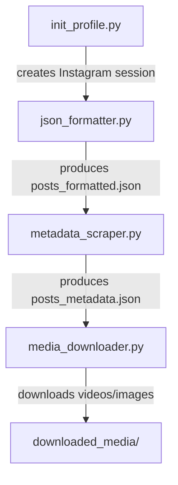

# Instagram Metadata Scraper

A lightweight set of Python scripts that automate the extraction of Instagram post metadata and media using the [instaloader](https://instaloader.github.io/) library.

## Overview
These four scripts work together to:
1. **Create a persistent Instagram session** that stores your login cookies for authenticated scraping.
2. **Convert the raw `posts_viewed.json`** (downloaded from Instagram) into a tidy list of URLs.
3. **Visit each URL**, scrape useful metadata (post ID, timestamps, like counts, comment counts, captions, etc.) and store the results in `posts_metadata.json`.
4. **Download any media** (videos and images) referenced in the scraped metadata.

---
### Python Packages
```powershell
pip install instaloader requests
```
>Install the Python dependencies as shown above.
---

## Project Structure

| File | Purpose |
|------|---------|
| `init_profile.py`| Prompts you for your Instagram username and session ID cookie, then saves the session locally so `instaloader` can reuse it. |
| `json_formatter.py`| Reads `posts_viewed.json` (or your own input json file) and writes a clean `posts_formatted.json` (or your own output formatted json file name) containing a flat list of unique URLs and associated metadata. |
| `metadata_scraper.py` | Iterates over the formatted URLs, scrapes post metadata using `instaloader`, and saves the result to `posts_metadata.json` (or your own output metadata json file name). Can run in authenticated or anonymous mode. |
| `media_downloader.py` | Consumes the JSON produced by the scraper and downloads all media files into a structured `downloaded_media/` directory (or your own directory name). |

---

## Workflow Overview



---

## Usage Guide

### 1️⃣ Initialise Instagram Profile (`init_profile.py`)
First, try to log in using the `instaloader` CLI:
```powershell
instaloader -l <Instagram_Username>
```
If the above command fails to run or authenticate, use the provided helper script:
```powershell
python init_profile.py
```
- You will be prompted to enter your **Instagram Username** and your **Session ID**.
- You can find your Session ID cookie (`sessionid`) from the Application tab in the developer tools of your web browser while logged into Instagram.
- After successfully running the script, your session cookies are stored in your local system and will be reused by the scraper.
> **Note:** If you want to scrape metadata without using a dummy account, you can skip this step to fetch public metadata in unauthenticated mode.

### 2️⃣ Format the raw JSON (`json_formatter.py`)
```powershell
python json_formatter.py -i posts_viewed.json -o posts_formatted.json
```
- The script extracts the URL for each entry, de‑duplicates them, and adds standard timestamps.
- Result: `posts_formatted.json` – a tidy JSON with a top‑level `posts` array and a `meta` block.

### 3️⃣ Scrape Metadata (`metadata_scraper.py`)
```powershell
python metadata_scraper.py -i posts_formatted.json -o posts_metadata.json -u <Instagram_Username> -l 50 # optional: stop after 50 URLs
```
- Reads the formatted URLs and fetches detailed metadata for each post using `instaloader`.
- Extracts:
  - Media ID, timestamps (Unix + ISO)
  - Caption, hashtags, tagged users
  - Like and comment counts
  - Media URLs (video, thumbnail)
  - Additional context (location, sidecar count, is_pinned flag, owner details, etc.)
- Progress and a run‑summary are printed to the console and saved alongside the scraped results.

### 4️⃣ Download Media (`media_downloader.py`)
```powershell
python media_downloader.py -i posts_metadata.json -dir downloaded_media
```
- Traverses the `results` array and fetches each media URL using `requests` (streamed download).
- Files are stored in `downloaded_media/<SHORTCODE>/`:
  - `<shortcode>_video.mp4` (if present)
  - `<shortcode>_image.jpg` (if present)
- Logs give you a quick overview of successes and skipped items.

---

## JSON Formats Explained

### `posts_viewed.json`
The raw export from Instagram. Each entry typically contains a `label_values` array.
```json
[
  {
    "title": "Post",
    "timestamp": 1690000000,
    "label_values": [
      {
        "label": "URL",
        "value": "https://www.instagram.com/p/ABCDE12345/"
      }
    ]
  }
]
```

### `posts_formatted.json`
```json
{
  "meta": {
    "source_file": "posts_viewed.json",
    "total_raw_entries": 1234,
    "total_unique_posts": 1000,
    "skipped_no_url": 0,
    "skipped_duplicate": 234,
    "generated_at_utc": "2026-06-23T02:00:00Z"
  },
  "posts": [
    {
      "post_index": 1,
      "post_url": "https://www.instagram.com/p/ABCDE12345/",
      "shortcode": "ABCDE12345",
      "timestamp_unix": 1690000000,
      "timestamp_iso": "2023-07-22T08:53:20Z",
      "fbid": null,
      "owner": {
        "name": "Jane Doe",
        "username": "janedoe",
        "profile_url": "https://www.instagram.com/janedoe/"
      }
    }
    // "… more entries …"
  ]
}
```
Only the `post_url` and `shortcode` fields are needed by the scraper.

### `posts_metadata.json`
```json
{
  "run_summary": {
    "input_file": "posts_formatted.json",
    "output_file": "posts_metadata.json",
    "total_posts_in_file": 1000,
    "scrape_limit_applied": 50,
    "authenticated": true,
    "total_posts_attempted": 50,
    "successfully_fetched": 48,
    "failed_to_fetch": 2,
    "success_rate_percent": 96.0,
    "total_time_seconds": 320.5,
    "total_time_taken": "5m 20s",
    "completed_at_utc": "2026-06-23T02:05:00Z"
  },
  "results": [
      // "..For Post or Reel.."
    {
      "post_index": "Sequential index assigned to the post during scraping",
      "post_url": "The direct Instagram URL of the scraped post",
      "shortcode": "The unique alphanumeric identifier for the Instagram post",
      "status": "The completion status of the metadata extraction process",
      "metadata": {
        "media_id": "The unique numeric ID of the media object",
        "typename": "The GraphQL node type (e.g., GraphSidecar, GraphImage, GraphVideo)",
        "is_video": "Boolean indicating whether the post is a video",
        "video_url": "Link to the video source file (null if it is not a video)",
        "video_view_count": "Total number of views on the video (null if not a video)",
        "thumbnail_url": "URL of the post's thumbnail image or primary photo",
        "like_count": "Total number of likes the post received",
        "comment_count": "Total number of comments on the post",
        "caption": "The main text/caption written by the post owner",
        "caption_hashtags": "List of hashtags extracted from the post's caption",
        "caption_mentions": "List of user accounts mentioned within the caption text",
        "tagged_users": "List of usernames explicitly tagged in the media",
        "accessibility_caption": "Auto-generated or user-provided alt text for visual accessibility",
        "owner_username": "The Instagram handle/username of the post creator",
        "owner_id": "The unique numeric identifier of the post creator's account",
        "owner_full_name": "The display name of the post creator",
        "owner_follower_count": "The total number of followers the post creator has",
        "owner_bio": "The biography text from the post creator's profile",
        "owner_external_url": "The external link featured in the post creator's bio",
        "owner_profile_pic_url": "URL of the post creator's profile picture",
        "posted_at_utc": "Timestamp of when the post was published, formatted as a UTC ISO string",
        "posted_at_unix": "Timestamp of when the post was published, in Unix seconds",
        "location": "The geographical location tagged in the post (null if none)",
        "sidecar_count": "The number of media items (photos/videos) within a carousel/album post",
        "is_pinned": "Boolean indicating whether the post is pinned to the top of the user's profile",
        "fetched_at_utc": "Timestamp of when the metadata was scraped, formatted as a UTC ISO string"
      }
    },
        //"..For Profile or Page.."
    {
  "post_index": "Sequential index assigned to the profile during scraping",
  "post_url": "The direct Instagram URL of the scraped profile",
  "shortcode": "The unique alphanumeric identifier extracted from the profile URL",
  "status": "The completion status of the metadata extraction process",
  "metadata": {
    "typename": "The GraphQL node type, indicating this is a profile (e.g., GraphProfile)",
    "username": "The Instagram handle or username of the profile",
    "full_name": "The display name of the user",
    "category": "The business or creator category of the profile (e.g., Digital Creator, null if not applicable)",
    "follower_count": "The total number of accounts following this profile",
    "following_count": "The total number of accounts this profile is following",
    "profile_picture_url": "URL of the user's profile picture",
    "bio_text": "The biography or about text written on the user's profile",
    "is_private": "Boolean indicating whether the profile account is set to private",
    "fetched_at_utc": "Timestamp of when the metadata was scraped, formatted as a UTC ISO string"
  }
}
    // "… more results …"
  ]
}
```

## Note

If you encounter rate limit errors (`429 Too Many Requests`) or `LoginRequiredException` while scraping:
- Try to increase the `time.sleep` interval between requests in `metadata_scraper.py`.
- Re-authenticate by refreshing your `sessionid` cookie from the browser and running `init_profile.py` again.

## License

This project is provided **as‑is** for educational purposes. Use responsibly and respect Instagram's terms of service.
